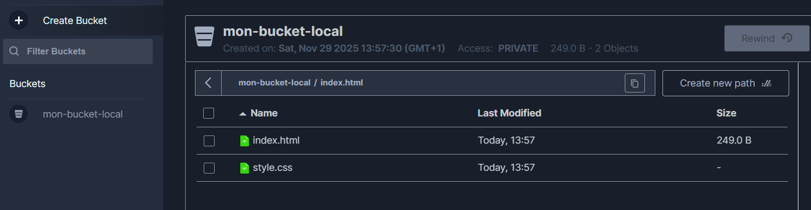
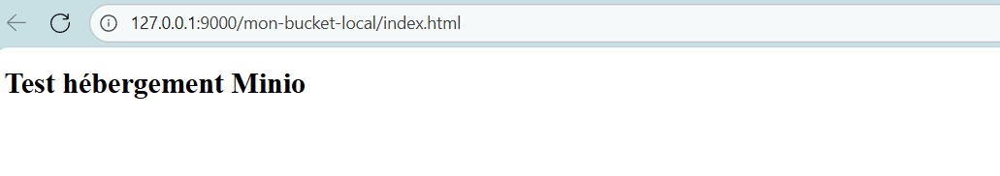

TP1 Cloud – Introduction au Cloud avec OpenTofu et MinIO

---

# 1️. Objectif pédagogique

L’objectif de ce TP est de découvrir les concepts fondamentaux du Cloud Computing en utilisant des outils open source exécutés localement.

Ce TP introduit :

L’infrastructure as code (IaC) avec OpenTofu

Le stockage objet avec MinIO

OpenTofu : alternative libre à Terraform, permettant la gestion déclarative de ressources via des fichiers de configuration.

MinIO : solution libre de stockage objet compatible avec l’API S3 d’AWS, permettant de manipuler des fichiers dans des buckets locaux comme sur un cloud public.

---

# 2. Fichiers

- main.tf : décrit l’infrastructure MinIO
- variables.tf et outputs.tf : pour les valeurs configurables
- terraform.tfvars : contient les identifiants MinIO (non versionné)
- index.html et style.css : site web statique
- public_policy.json : policy pour rendre uniquement les fichiers nécessaires publics

---

# 3. Lancement du serveur MinIO

Création d'un dossier de travail:
```bash
    mkdir ~/minio-data
```

Lancement du serveur MinIO en local :
```bash
    minio server ~/minio-data --console-address ":9001"
```

Console MinIO disponible sur :  http://localhost:9001

Identifiants par défaut :  
- Utilisateur   : minioadmin  
- Mot de passe  : minioadmin  

---

# 4. Initialisation et déploiement

Initialiser le projet :
```bash
tofu init
```

Vérifier le plan :
```bash
tofu plan
```

Appliquer la configuration :
```bash
tofu apply
```

Supprimer les ressources : 
```bash
tofu destroy
```

## Infrastructure mise en place

- Bucket privé : mon-bucket-local
- Upload automatique de : index.html et style.css
- Policy publique : public_policy.json appliquée uniquement aux fichiers du site
- Variables et secrets externalisés via terraform.tfvars
- Outputs affichant le nom du bucket et les URLs publiques

---

# 5. Résultats

## Buckets créés

Bucket privé : mon-bucket-local



## Fichiers uploadés

- index.html
- style.css

## Site web accessible

URL locale : http://127.0.0.1:9000/mon-bucket-local/index.html


## Policy appliquée

Seuls index.html et style.css sont publics

Le reste du bucket reste privé

```json
{
  "Version": "2012-10-17",
  "Statement": [
    {
      "Effect": "Allow",
      "Principal": "*",
      "Action": ["s3:GetObject"],
      "Resource": [
        "arn:aws:s3:::mon-bucket-local/index.html",
        "arn:aws:s3:::mon-bucket-local/style.css"
      ]
    }
  ]
}
```

## Outputs

Nom du bucket et URLs publiques affichés après tofu apply